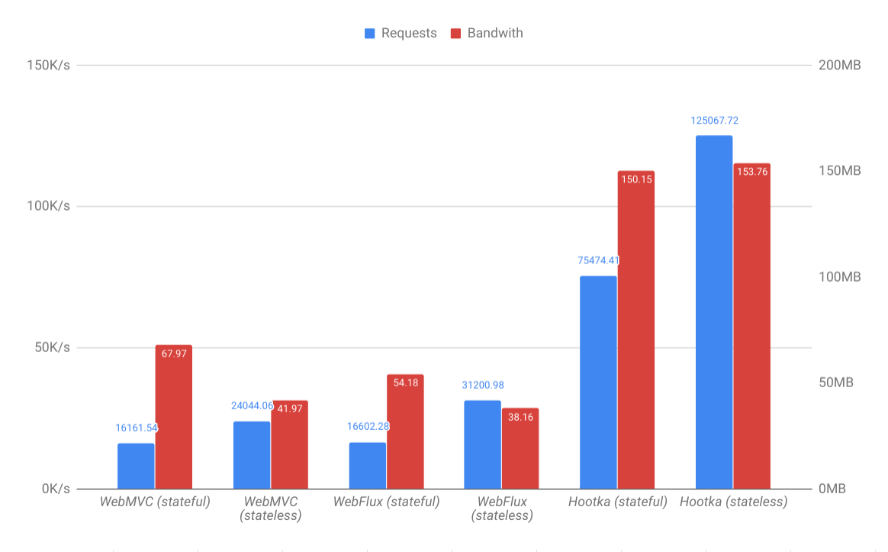

## Installation

Using gradle

```groovy
compile("io.zensoft.web:spring-boot-netty:1.0.0")
```

Using maven

```xml
<dependency>
    <groupId>io.zensoft.web</groupId>
    <artifactId>spring-boot-netty</artifactId>
    <version>1.0.0</version>
</dependency>
```

## Configuration

### application.properties parameters

Below listed parameters, which are available for configuration

|                    Name                     |  Default Value  |                       Description                         |
|:-------------------------------------------:|:---------------:|:---------------------------------------------------------:|
|                server.port                  |       8080      |                 Port, listened by server                  |
|          web.session.cookie-name            |    session_id   |             Name of session identifier cookie             |
|         web.session.cookie-max-age          |       1800      |     Time, when session cookie considered as not expired   |
|     web.security.remember-me-token-name     |   remind_token  |                Name of remember-me cookie                 |
|    web.security.remember-me-token-max-age   |     2592000     |  Time, when remember-me cookie considered as not expired  |
|        web.security.remember-me-salt        |   default_salt  |        Salt, used for generation of remember-me token     |
|            freemarker.path.prefix           |    templates/   |  Directory path, where freemarker templates located       |
|            freemarker.path.suffix           |       .ftl      |              Freemarker templates extension               |

### Static resources configuration

There are two default types of static resource providers:
 - ClasspathResourceHandler - resolves static resources, located in classpath
 - FilesystemResourceHandler - resolves static resources, located in file system
 
Both of them has three parameters to configure:

|            Name           |    Type    |  Required  |                       Description                        |
|:-------------------------:|:----------:|:----------:|:--------------------------------------------------------:|
|         mappedPath        |   String   |     Yes    |            Path to get static resource from url          |
|          basePath         |   String   |     Yes    |               Path to actual folder location             |
|         cacheable         |   Boolean  |     No     |  Flag, whether allow resource caching by browser or not  |

### Security configuration

#### User details service

UserDetailsService interface responsible for fetching user information. 
Implement method `findUserDetailsByUsername(value: String): UserDetails?`, getting user from any storage 

#### Authentication provider

There is Default SecurityProvider interface implementation, which requires instances of SessionStorage and UserDetailsService. 
In case, if `remember me` functionality required, instance of RememberMeService (described below) should also be specified 
in DefaultSecurityProvider constructor

```kotlin
DefaultSecurityProvider(sessionStorage, userDetailsService, rememberMeService)
```

#### Remember me service

There is Default RememberMeService interface implementation. It creates special token, based on current user's login 
and password. To create instance, there should be 4 parameters specified:
- Name of cookie, where token will be stored
- Cookie's expiry period
- Salt for token generation
- User Details Service for auto authentication

```kotlin
DefaultRememberMeService(rememberMeTokenName, rememberMeTokenMaxAge, rememberMeSalt, userDetailsService)
```

## Usage


### Annotation description

|        Name       |  Allowed usage  |                                                               Description                                                         |
|:------------------|:---------------:|:---------------------------------------------------------------------------------------------------------------------------------:|
| @Controller       |      CLASS      |                                                  Describes class as handler container                                             |
| @ControllerAdvice |      CLASS      |                                          Describes class as handler post processors container                                     |
| @ResponseStatus   | CLASS, FUNCTION |                                               Marks response with specific HTTP status                                            |
| @Stateless        | CLASS, FUNCTION |                                       Marks handler that it does not require session resolution                                   |
| @PreAuthorize     | CLASS, FUNCTION | Allows specification of filter method, whether incoming request allowed to be handled. Not working in combination with @Stateless |
| @RequestMapping   | CLASS, FUNCTION |                                        Specifies path and method, which handler should process                                    |
| @ExceptionHandler |     FUNCTION    |                                          Marks method, which handles specific exception type                                      |
| @ModelAttribute   | VALUE_PARAMETER |                                 Marks that parameter is deserialized form-encoded content in request                              |
| @MultipartFile    | VALUE_PARAMETER |                                           Marks that parameter is content of uploaded file                                        |
| @MultipartObject  | VALUE_PARAMETER |                                          Marks that parameter is request's multipart content                                      |
| @PathVariable     | VALUE_PARAMETER |                 Marks that parameter should be taken from request path, instead of specified wildcard (for example `{id}`)        |
| @Principal        | VALUE_PARAMETER |                                           Marks that parameter contains user information                                          |
| @RequestBody      | VALUE_PARAMETER |                                  Marks that parameter is deserialized JSON content from request                                   |
| @RequestParam     | VALUE_PARAMETER |                                   Marks that parameter is a value of request's query parameter                                    |

#### Annotation parameters

__@ExceptionHandler__
- values (Array<KClass<out Throwable>>) - exceptions, should be handled in method
- produces (MimeType) - response type, returned to client

__@MultipartFile__
- acceptExtensions (Array<String>) - set of extensions, acceptable for handler

__@MultipartObject__
- acceptExtensions (Array<String>) - set of extensions, acceptable for handler

__@PathVariable__
- value (String) - name of path variable

__@PreAuthorize__
- value (String) - string representation of method, which should be invoked

__@RequestMapping__
- value (Array<String>) - paths, which handler able to process
- produces (MimeType) - response type, returned to client
- method (HttpMethod) - http method, which handler able to process

__@RequestParam__
- value (String) - name of query parameter

__@ResponseStatus__
- value (HttpStatus) - http response status, which should be sent to client

#### Specific values

__HttpStatus__
- OK
- FOUND
- NOT_FOUND
- BAD_REQUEST
- METHOD_NOT_ALLOWED
- INTERNAL_SERVER_ERROR
- FORBIDDEN
- UNAUTHORIZED
- CONFLICT
- MOVED_PERMANENTLY
- UNPROCESSABLE_ENTITY

__MimeType__
- TEXT_PLAIN
- APPLICATION_JSON
- APPLICATION_OCTET_STREAM
- BYTES
- TEXT_HTML
- TEXT_CSS
- TEXT_JAVASCRIPT
- IMAGE_GIF
- IMAGE_PNG
- IMAGE_JPEG
- IMAGE_SVG
- IMAGE_ICO
- FONT_TTF
- FONT_WOFF2

__HttpMethod__
- GET
- POST
- PUT
- DELETE
- TRACE
- OPTIONS
- HEAD

### Example controller

Here is a sample controller, how it looks like

```kotlin
@Controller // 1
@PreAuthorize("hasRole('ADMIN')") // 2
@RequestMapping(value = ["/api/users"]) //3
class UserController(
    private val service: UserService
) {

    @RequestMapping(value = ["/all"], method = GET) // 4
    fun getAll(searchRequest: UserSearchRequest, @Valid pageRequest: UserPageRequest): PageResponse<UserDto> { // 5
        val page = service.getAll(searchRequest, pageRequest).map { UserDto(it) }
        return PageResponse(page)
    }

    @PreAuthorize("isAuthenticated()") // 6
    @RequestMapping(value = ["/current"])
    fun getCurrentUser(@Principal user: User): UserDto { // 7
        return UserDto(user)
    }

    @RequestMapping(value = ["/{id}/doEnable"])
    fun enableUser(@PathVariable userId: Long) { // 8
        service.setUserEnabled(userId, true)
    }

    @RequestMapping(method = POST)
    fun add(@RequestBody @Valid request: UserRequest): UserDto { // 9
        return UserDto(service.add(request))
    }

}
```

1) To declare controller add @Controller annotation from `io.zensoft.web.annotation` package 
2) Common PreAuthorize method, used for all handlers in controller
3) Common request mapping. Each handler's path will start with this prefix
4) Request mapping for specific method, path appended to the common mapping, so path to handler will be `/api/users/all`
5) @Valid annotation from validation API is compatible with request parameters
6) Specific PreAuthorized method, common one, specified on controller, will be ignored
7) User information is available in this handler
8) userId is taken from request path
9) request field will be deserialized request JSON content


## Performance Comparison



### Environment

KVM, Ubuntu 18.04, 16384 MB RAM, 4 CPU

Run with java options:

```
-server
-Xmx2G
-Xms2G
-XX:+UseConcMarkSweepGC
-XX:+UseParNewGC
-XX:+CMSParallelRemarkEnabled
-XX:CMSInitiatingOccupancyFraction=75
-XX:+UseCMSInitiatingOccupancyOnly
```

Test: `$ wrk -t12 -c400 -d30s --latency http://host/status`

### Tomcat Stateful

```
Running 30s test @ http://192.168.88.53:8080/status
  12 threads and 400 connections
  Thread Stats   Avg      Stdev     Max   +/- Stdev
    Latency    42.74ms   54.69ms 542.25ms   83.67%
    Req/Sec     1.65k   440.98     7.07k    68.87%
  Latency Distribution
     50%   21.11ms
     75%   73.81ms
     90%  119.04ms
     99%  224.03ms
  593167 requests in 30.07s, 216.76MB read
Requests/sec:  19725.99
Transfer/sec:      7.21MB
```

### Tomcat Stateless

```
Running 30s test @ http://192.168.88.53:8080/status
  12 threads and 400 connections
  Thread Stats   Avg      Stdev     Max   +/- Stdev
    Latency    44.99ms   79.26ms   1.16s    88.41%
    Req/Sec     2.47k   593.50    12.03k    72.88%
  Latency Distribution
     50%   14.47ms
     75%   48.50ms
     90%  141.11ms
     99%  369.88ms
  885394 requests in 30.10s, 106.55MB read
Requests/sec:  29417.08
Transfer/sec:      3.54MB
```

### Spring Reactive - Webflux Stateful

```
Running 30s test @ http://192.168.88.53:8080/status
  12 threads and 400 connections
  Thread Stats   Avg      Stdev     Max   +/- Stdev
    Latency    28.28ms    6.47ms 136.73ms   82.60%
    Req/Sec     1.17k   104.02     3.64k    82.92%
  Latency Distribution
     50%   25.44ms
     75%   30.77ms
     90%   38.49ms
     99%   48.70ms
  419259 requests in 30.08s, 121.55MB read
Requests/sec:  13937.08
Transfer/sec:      4.04MB
```

### Spring Reactive - Webflux Stateless

```
Running 30s test @ http://192.168.88.53:8080/status
  12 threads and 400 connections
  Thread Stats   Avg      Stdev     Max   +/- Stdev
    Latency    15.79ms    7.47ms 117.62ms   87.12%
    Req/Sec     2.17k   166.32     3.57k    77.18%
  Latency Distribution
     50%   12.23ms
     75%   15.28ms
     90%   25.83ms
     99%   41.92ms
  777917 requests in 30.11s, 67.51MB read
Requests/sec:  25837.14
Transfer/sec:      2.24MB
```

### Hootka Stateful

```
Running 30s test @ http://192.168.88.53:8080/status
  12 threads and 400 connections
  Thread Stats   Avg      Stdev     Max   +/- Stdev
    Latency     8.26ms   11.25ms 184.71ms   93.51%
    Req/Sec     5.47k     1.19k   18.29k    81.83%
  Latency Distribution
     50%    4.24ms
     75%    7.92ms
     90%   14.78ms
     99%   62.12ms
  1961456 requests in 30.09s, 318.00MB read
Requests/sec:  65181.72
Transfer/sec:     10.57MB
```

### Hootka Stateless

```
Running 30s test @ http://192.168.88.53:8080/status
  12 threads and 400 connections
  Thread Stats   Avg      Stdev     Max   +/- Stdev
    Latency     4.53ms    3.36ms  76.77ms   87.34%
    Req/Sec     8.23k     1.09k   31.32k    75.15%
  Latency Distribution
     50%    2.93ms
     75%    4.71ms
     90%    9.28ms
     99%   16.95ms
  2951774 requests in 30.08s, 256.17MB read
Requests/sec:  98120.63
Transfer/sec:      8.52MB
```