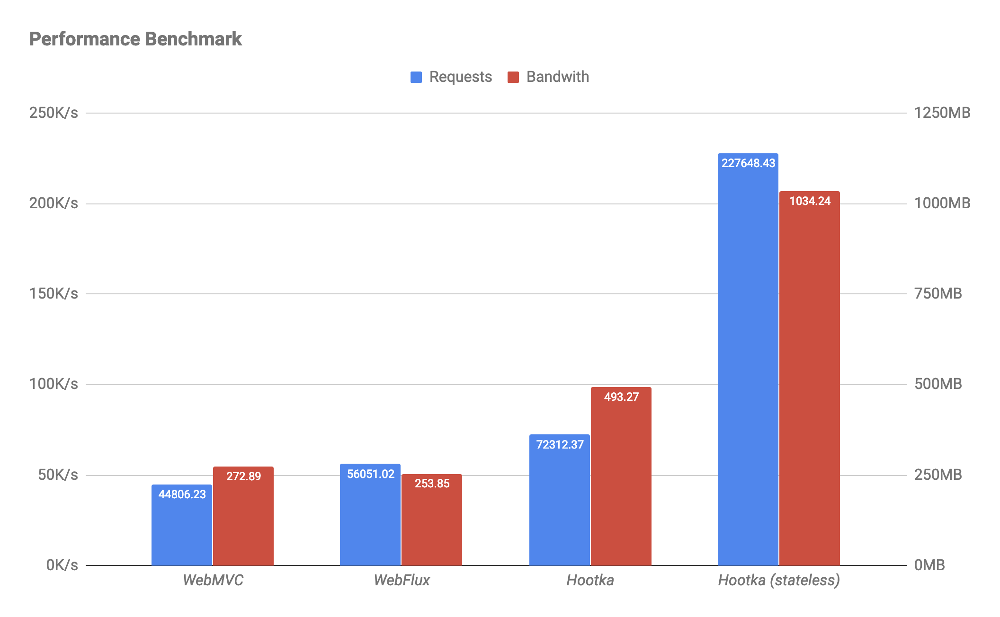

## Installation

Using gradle

```groovy
compile("io.zensoft.web:spring-boot-netty:1.0.0")
```

Using maven

```xml
<dependency>
    <groupId>io.zensoft.web</groupId>
    <artifactId>spring-boot-netty</artifactId>
    <version>1.0.0</version>
</dependency>
```

## Configuration

### application.properties parameters

Below listed parameters, which are available for configuration

|                    Name                     |  Default Value  |                       Description                         |
|:-------------------------------------------:|:---------------:|:---------------------------------------------------------:|
|                server.port                  |       8080      |                 Port, listened by server                  |
|          web.session.cookie-name            |    session_id   |             Name of session identifier cookie             |
|         web.session.cookie-max-age          |       1800      |     Time, when session cookie considered as not expired   |
|     web.security.remember-me-token-name     |   remind_token  |                Name of remember-me cookie                 |
|    web.security.remember-me-token-max-age   |     2592000     |  Time, when remember-me cookie considered as not expired  |
|        web.security.remember-me-salt        |   default_salt  |        Salt, used for generation of remember-me token     |
|            freemarker.path.prefix           |    templates/   |  Directory path, where freemarker templates located       |
|            freemarker.path.suffix           |       .ftl      |              Freemarker templates extension               |

### Static resources configuration

There are two default types of static resource providers:
 - ClasspathResourceHandler - resolves static resources, located in classpath
 - FilesystemResourceHandler - resolves static resources, located in file system
 
Both of them has three parameters to configure:

|            Name           |    Type    |  Required  |                       Description                        |
|:-------------------------:|:----------:|:----------:|:--------------------------------------------------------:|
|         mappedPath        |   String   |     Yes    |            Path to get static resource from url          |
|          basePath         |   String   |     Yes    |               Path to actual folder location             |
|         cacheable         |   Boolean  |     No     |  Flag, whether allow resource caching by browser or not  |

### Security configuration

#### User details service

UserDetailsService interface responsible for fetching user information. 
Implement method `findUserDetailsByUsername(value: String): UserDetails?`, getting user from any storage 

#### Authentication provider

There is Default SecurityProvider interface implementation, which requires instances of SessionStorage and UserDetailsService. 
In case, if `remember me` functionality required, instance of RememberMeService (described below) should also be specified 
in DefaultSecurityProvider constructor

```kotlin
DefaultSecurityProvider(sessionStorage, userDetailsService, rememberMeService)
```

#### Remember me service

There is Default RememberMeService interface implementation. It creates special token, based on current user's login 
and password. To create instance, there should be 4 parameters specified:
- Name of cookie, where token will be stored
- Cookie's expiry period
- Salt for token generation
- User Details Service for auto authentication

```kotlin
DefaultRememberMeService(rememberMeTokenName, rememberMeTokenMaxAge, rememberMeSalt, userDetailsService)
```

## Usage


### Annotation description

|        Name       |  Allowed usage  |                                                               Description                                                         |
|:------------------|:---------------:|:---------------------------------------------------------------------------------------------------------------------------------:|
| @Controller       |      CLASS      |                                                  Describes class as handler container                                             |
| @ControllerAdvice |      CLASS      |                                          Describes class as handler post processors container                                     |
| @ResponseStatus   | CLASS, FUNCTION |                                               Marks response with specific HTTP status                                            |
| @Stateless        | CLASS, FUNCTION |                                       Marks handler that it does not require session resolution                                   |
| @PreAuthorize     | CLASS, FUNCTION | Allows specification of filter method, whether incoming request allowed to be handled. Not working in combination with @Stateless |
| @RequestMapping   | CLASS, FUNCTION |                                        Specifies path and method, which handler should process                                    |
| @ExceptionHandler |     FUNCTION    |                                          Marks method, which handles specific exception type                                      |
| @ModelAttribute   | VALUE_PARAMETER |                                 Marks that parameter is deserialized form-encoded content in request                              |
| @MultipartFile    | VALUE_PARAMETER |                                           Marks that parameter is content of uploaded file                                        |
| @MultipartObject  | VALUE_PARAMETER |                                          Marks that parameter is request's multipart content                                      |
| @PathVariable     | VALUE_PARAMETER |                 Marks that parameter should be taken from request path, instead of specified wildcard (for example `{id}`)        |
| @Principal        | VALUE_PARAMETER |                                           Marks that parameter contains user information                                          |
| @RequestBody      | VALUE_PARAMETER |                                  Marks that parameter is deserialized JSON content from request                                   |
| @RequestParam     | VALUE_PARAMETER |                                   Marks that parameter is a value of request's query parameter                                    |

#### Annotation parameters

__@ExceptionHandler__
- values (Array<KClass<out Throwable>>) - exceptions, should be handled in method
- produces (MimeType) - response type, returned to client

__@MultipartFile__
- acceptExtensions (Array<String>) - set of extensions, acceptable for handler

__@MultipartObject__
- acceptExtensions (Array<String>) - set of extensions, acceptable for handler

__@PathVariable__
- value (String) - name of path variable

__@PreAuthorize__
- value (String) - string representation of method, which should be invoked

__@RequestMapping__
- value (Array<String>) - paths, which handler able to process
- produces (MimeType) - response type, returned to client
- method (HttpMethod) - http method, which handler able to process

__@RequestParam__
- value (String) - name of query parameter

__@ResponseStatus__
- value (HttpStatus) - http response status, which should be sent to client

#### Specific values

__HttpStatus__
- OK
- FOUND
- NOT_FOUND
- BAD_REQUEST
- METHOD_NOT_ALLOWED
- INTERNAL_SERVER_ERROR
- FORBIDDEN
- UNAUTHORIZED
- CONFLICT
- MOVED_PERMANENTLY
- UNPROCESSABLE_ENTITY

__MimeType__
- TEXT_PLAIN
- APPLICATION_JSON
- APPLICATION_OCTET_STREAM
- BYTES
- TEXT_HTML
- TEXT_CSS
- TEXT_JAVASCRIPT
- IMAGE_GIF
- IMAGE_PNG
- IMAGE_JPEG
- IMAGE_SVG
- IMAGE_ICO
- FONT_TTF
- FONT_WOFF2

__HttpMethod__
- GET
- POST
- PUT
- DELETE
- TRACE
- OPTIONS
- HEAD

### Example controller

Here is a sample controller, how it looks like

```kotlin
@Controller // 1
@PreAuthorize("hasRole('ADMIN')") // 2
@RequestMapping(value = ["/api/users"]) //3
class UserController(
    private val service: UserService
) {

    @RequestMapping(value = ["/all"], method = GET) // 4
    fun getAll(searchRequest: UserSearchRequest, @Valid pageRequest: UserPageRequest): PageResponse<UserDto> { // 5
        val page = service.getAll(searchRequest, pageRequest).map { UserDto(it) }
        return PageResponse(page)
    }

    @PreAuthorize("isAuthenticated()") // 6
    @RequestMapping(value = ["/current"])
    fun getCurrentUser(@Principal user: User): UserDto { // 7
        return UserDto(user)
    }

    @RequestMapping(value = ["/{id}/doEnable"])
    fun enableUser(@PathVariable userId: Long) { // 8
        service.setUserEnabled(userId, true)
    }

    @RequestMapping(method = POST)
    fun add(@RequestBody @Valid request: UserRequest): UserDto { // 9
        return UserDto(service.add(request))
    }

}
```

1) To declare controller add @Controller annotation from `io.zensoft.web.annotation` package 
2) Common PreAuthorize method, used for all handlers in controller
3) Common request mapping. Each handler's path will start with this prefix
4) Request mapping for specific method, path appended to the common mapping, so path to handler will be `/api/users/all`
5) @Valid annotation from validation API is compatible with request parameters
6) Specific PreAuthorized method, common one, specified on controller, will be ignored
7) User information is available in this handler
8) userId is taken from request path
9) request field will be deserialized request JSON content


## Performance Comparison



### Environment

KVM, Ubuntu 18.04, 16384 MB RAM, 4 CPU

Run: `$ java -Xmx512M -server -jar application.jar`

Test: `$ wrk -t12 -c400 -d30s --latency http://host/api/user/current`

### Tomcat

```
Running 30s test @ http://localhost:8080/api/user
  12 threads and 400 connections
  Thread Stats   Avg      Stdev     Max   +/- Stdev
    Latency    28.38ms   60.69ms   1.13s    91.46%
    Req/Sec     3.77k     1.01k    8.55k    75.77%
  Latency Distribution
     50%    8.44ms
     75%   25.17ms
     90%   76.97ms
     99%  312.14ms
  1348558 requests in 30.10s, 272.89MB read
Requests/sec:  44806.23
Transfer/sec:      9.07MB
```

### Spring Reactive - Webflux

```
Running 30s test @ http://localhost:8080/api/user
  12 threads and 400 connections
  Thread Stats   Avg      Stdev     Max   +/- Stdev
    Latency     7.41ms    4.38ms 228.41ms   87.16%
    Req/Sec     4.70k   568.07     7.00k    86.56%
  Latency Distribution
     50%    5.52ms
     75%    8.11ms
     90%   13.07ms
     99%   24.71ms
  1684671 requests in 30.06s, 253.85MB read
Requests/sec:  56051.02
Transfer/sec:      8.45MB
```

### This

```
Running 30s test @ http://localhost:8080/api/user
  12 threads and 400 connections
  Thread Stats   Avg      Stdev     Max   +/- Stdev
    Latency    45.78ms  120.34ms 637.34ms   90.29%
    Req/Sec     7.09k     3.08k   19.56k    69.34%
  Latency Distribution
     50%    3.80ms
     75%   11.65ms
     90%  153.72ms
     99%  562.01ms
  2173245 requests in 30.05s, 493.27MB read
Requests/sec:  72312.37
Transfer/sec:     16.41MB
```

### This (stateless)

```
Running 30s test @ http://localhost:8080/api/user
  12 threads and 400 connections
  Thread Stats   Avg      Stdev     Max   +/- Stdev
    Latency     2.03ms    1.93ms  37.00ms   87.60%
    Req/Sec    19.09k     5.14k   63.30k    69.77%
  Latency Distribution
     50%    1.36ms
     75%    2.47ms
     90%    4.15ms
     99%    9.83ms
  6852119 requests in 30.10s, 1.01GB read
Requests/sec: 227648.43
Transfer/sec:     34.52MB
```